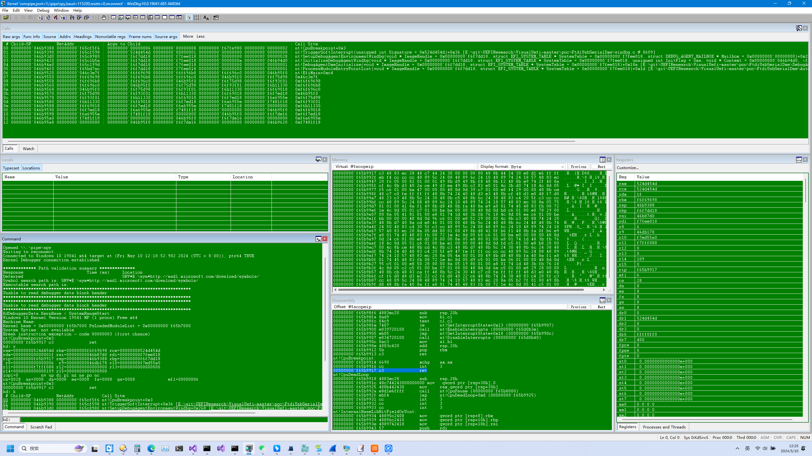
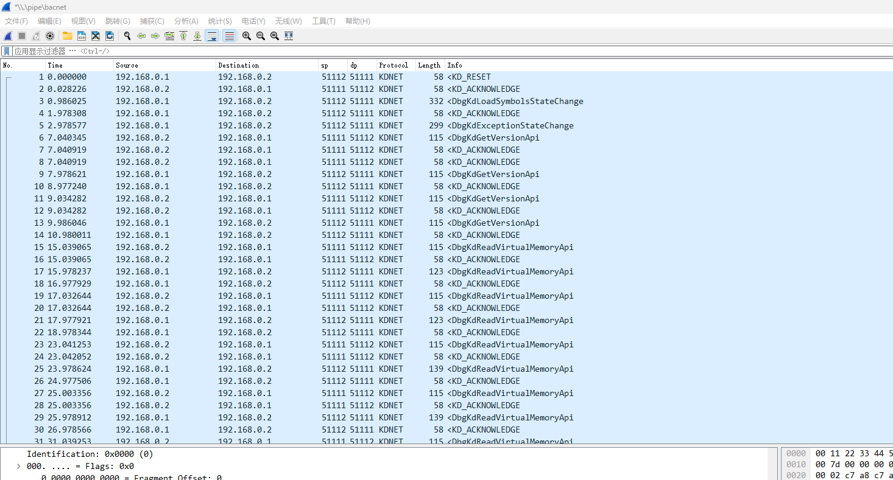
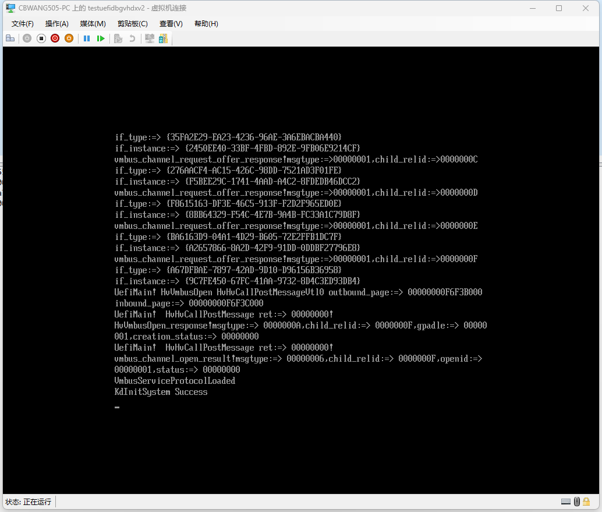

## 引用 ##

>这篇文章的目的是介绍一款实验性项目基于COM命名管道或者Windows Hyper-V虚拟机Vmbus通道实现的运行在uefi上的windbg调试引擎开发心得

[toc]

## 简介 ## 

笔者实现了一款运行在Windows Hyper-V uefi虚拟机上基于COM命名管道或者Vmbus通道的windbg调试协议引擎,通过中间人模式转发windbg内核命名管道调试数据适配到目的接口实现调试uefi程序,记录或者实时捕捉调试数据到wireshark解析插件分析.

## windbg调试协议分析 ## 

windbg内核命名管道调试协议是不同于包含配置key的net模式调试方式采用加密通信协议,是非加密的在[reactos](https://github.com/mirror/reactos/blob/c6d2b35ffc91e09f50dfb214ea58237509329d6b/reactos/drivers/base/kdcom/kddll.c)实现的大多数调试api的支持,笔者的工具是在这个基础上开发的,加密调试模式可以通过openssl相关加密函数实现,在原作者工具中提供对应的key就可以解密相关数据包,比如key为8.8.8.8,使用如下方式分析数据;
"C:\Program Files\Wireshark\Wireshark.exe" -Xlua_script:kdnet.lua -okdnet.key:8.8.8.8 -r "windbg-uncut.pcapng"
```
typedef struct _KD_PACKET
{
    ULONG PacketLeader;
    USHORT PacketType;
    USHORT ByteCount;
    ULONG PacketId;
    ULONG Checksum;   
} KD_PACKET, *PKD_PACKET;
```
上面的结构称为信息数据包的头结构,其中PacketLeader是整个数据包的导引数据包的类型,可以是控制数据包或者服务数据包,其中PacketType子类型PACKET_TYPE_KD_STATE_CHANGE供内核调试引擎向调试器报告状态变化,包含DBGKD_WAIT_STATE_CHANGE 结构.调试器收到后应该发送确认控制数据包PACKET_TYPE_KD_ACKNOWLEDGE使用和收到的数据包相同PacketId.PACKET_TYPE_KD_STATE_MANIPULATE供调试器调用内核调试引擎的各种服务(称为 KdAPI),内核调试引擎收到后,也是先发送确认控制数据包PACKET_TYPE_KD_ACKNOWLEDGE切换当前全局CurrentPacketId ^= 1,然后再通过这种类型数据包生成对应回包回复给调试器,调试器收到后再发送确认信息.调试器初始化阶段一般第一个包都是KD_RESET类型和调试器协商值回退到初始状态CurrentPacketId = INITIAL_PACKET_ID,然后DbgKdLoadSymbolsStateChange报告第一个nt内核的模块信息,windbg继续发送DbgKdGetVersionApi与调试器协商调试协议和操作系统版本信息,直到第一个断点触发DbgKdExceptionStateChange报告调试器状态变化,其中KdpSendWaitContinue函数是调试引擎中与调试器进行交互式对话的主要函数.这个过程在发送一个入口数据包给调试器后,开始一个循环反复等待和处理来自调试器的操纵状态信息数据包,调试器查询完断点异常需要相关信息后中断到调试器,直到发送DbgKdContinueApi2继续程序从断点处执行直到触发下个断点继续这个循环,由于在KdpSendWaitContinue函数中每次读取的数据包类型可能不是期望的数据包类型,笔者加入了一个延迟数据包缓存链表结构优化这个问题,如果判断非当前期望数据包类型将读到的包加入链表继续读取下个包,如果尝试最大次数读取超时重发当前数据包继续读取,开始读取时当前缓存链表有数据时从缓存链表取出匹配数据包继续下次迭代,没有匹配数据包继续从输入缓冲区读取如此反复循环.笔者沿用了edk2的SourceLevelDebugPkg模块的Intel(R) UEFI Development Kit Debugger Tool调试协议的cpu上下文结构获取方式,首先初始化阶段配置IDT中断向量,在回调函数InterruptProcess获取的PDEBUG_CPU_CONTEXT寄存器上下文信息转换为PCONTEXT的windbg类型,在DbgKdExceptionStateChange报告调试器状态变化,配置同时保留了VMBUS_MESSAGE_SINT中断向量互不干扰.上报的调试状态信息可以正常被windbg处理,这里需要修复的一点,对于内存操作如果需要读取或者写入的内存区域的对调试器是不可读的,直接进行读写操作后会产生双重的GP异常,可以通过查询EFI_BOOT_SERVICES->GetMemoryMap内存映射表或者调用HvCallTranslateVirtualAddress查询相关内存页的属性是否符合读写要求,不符合返回全0数据不影响调试器.如果读取是Gdtr所指向的内存区域先申请一份影子数据保存这段内容,然后在读取的api中判断是否是查询Gdtr所指向的内存区域返回影子数据,这样就解决的在windbg中看到的段cs寄存器为16位的错误,消除了对内存操作的影响.调试器工程编译为uefi运行时驱动服务,导出调试器接口给uefi应用程序使用,具体Protocol使用方法只需要如下代码启用
```
VOID NTAPI OutputMsg(_In_ CHAR16* msg)
{
	if(EnableWindbgPluginInitialized)
	{
		pWindbgProtocol->OutputMsg(msg);
	}else
	{
		Print(msg);
	}
	
	return;
}
//启用调试插件
BOOLEAN EnableWindbgPlugin(WCHAR* exepath)
{
	EFI_STATUS efiStatus = gBS->LocateProtocol(&gEfiWindbgProtocolGUID, NULL, &pWindbgProtocol);
	EnableWindbgPluginInitialized = TRUE;
	OutputMsg(L"EnableWindbgPlugin\r\n");
	FindAndReportModuleImageInfo(exepath);	
	return TRUE;
}
```

## Windows Hyper-V虚拟机Vmbus通道分析 ## 

COM命名管道由原生IO端口实现uefi串口库已经实现了此功能,将笔者项目配置为Vmbus通道的windbg调试协议引擎模式,Vmbus通道Windows Hyper-V虚拟化堆栈提供的一种机制,可供应虚拟机实现分区间通信随Hyper-V Integration Services 一起安装,打开Hyper-V虚拟机Integration Services选项卡可用配置为虚拟机提供的vmbus服务.虚拟机vmbus服务提供者Virtualization Service Provider (VSP)运行在宿主机上通常是在根分区或者是在嵌套虚拟化模式的父分区上运行,由vmbusr.sys相关驱动程序承载,虚拟机类客户端程序Virtualization Service Clients (VSC)运行在虚拟机中,虚拟机可以是windows和linux或者uefi等实现vmbus服务驱动程序.虚拟通道为每个vcpu绑定通道消息共享Simp页面保存在HvSyntheticMsrSimp的MSR寄存器中,还需要指定通道消息中断IDT回调索引HV_X64_MSR_SINT0默认为VMBUS_MESSAGE_SINT2同样需要在通道协商消息中配置,所有通道消息在VSP的由vmbusr.sys处理后会向虚拟机注入sint中断,中断源在vmbusisr中放入一个dpc队列进行处理.这个过程VSC需要先向VSP协商和申请支持的虚拟通道类型,VSP发出HVPostMessage的hypercall通知VSC触发IDT回调在Simp消息页面读取返回数据,这些通道类型通过GUID标识包括接口类型和实例类型,也可以通过vmbuspiper.dll使用VmbusPipeServerOfferChannel创建类似命名管道的自定义通道笔者用的就是这种方式.通道通过in和out两个环形缓冲区环形缓冲区传输数据,数据页面在使用一种GPADL的结构体由VSP和VSC共享映射页面,具体形式是VSC提供pfn(页帧号)由虚拟机监控程序Hypervisor协助映射VSP物理页面至虚拟地址MDL结构,页面共享后VSC发送CHANNELMSG_OPENCHANNEL消息建立环形缓冲区传输数据通道,通道成功建立后VSP会发送一个CHANNELMSG_OFFERCHANNEL消息通知通道已经准备就绪,双方开始读写缓冲区数据,传输状态控制结构在缓冲区的第一个页面中,数据在第二个页面之后,每次读取或者写入数据后更新传输状态控制结构,最后需要使用HvCallSignalEvent通知接收者触发通道数据事件中断.
```
struct vmpacket_descriptor {
	u16 type;
	u16 offset8;
	u16 len8;
	u16 flags;
	u64 trans_id;
} ;
struct vmbuspipe_hdr {
	u32 flags;
	u32 msgsize;
} ;
//传输状态控制结构
struct hv_ring_buffer {  
        u32 write_index;
        u32 read_index;
}
[DllImport("vmbuspiper.dll", EntryPoint = "VmbusPipeServerConnectPipe")]
[return: MarshalAs(UnmanagedType.Bool)]
public static extern   bool  VmbusPipeServerConnectPipe(  [In] IntPtr PipeHandle,         IntPtr Overlapped);
[DllImport("vmbuspiper.dll", EntryPoint = "VmbusPipeServerOfferChannel")]
public static extern SafeFileHandle  VmbusPipeServerOfferChannel(    [In] IntPtr Offer,    uint OpenMode,    uint PipeMode);

IntPtr offerinf = VMBUS_PIPE_SERVER_OFFER.NewOffer(vmguiid);
SafeFileHandle pipinst = Vmbuspiper.VmbusPipeServerOfferChannel(offerinf, 0x40000000, 0);
if (!pipinst.IsInvalid)
{             
    bool ret = Vmbuspiper.VmbusPipeServerConnectPipe(pipinst.DangerousGetHandle(), IntPtr.Zero);  
    //通过标准的文件读写函数操作通道数据
    ret = Kernel32.ReadFileEx(pipinst.DangerousGetHandle(), bufferPtrasync,
                            (uint)readbufasync.Length, ref lpOverlappedRead,
                            readCompletionRoutine);
    ret = Kernel32.WriteFileEx(pipinst.DangerousGetHandle(), writebufPtr, (uint)writebuf.Length,
                            ref lpOverlappedWrite,
                            writeCompletionRoutine);
    ....                                                 
]
```
环形缓冲区使用一个首尾相连的结构展示需要传输的数据,每次写入者写完后更新传输状态控制结构write_index,读取者读取后更新read_index,比如缓冲区中大小为0x1000字节,写入数据超过结尾就从头部开始写入,比如说write_index为0xf00,需要写入0x300的数据,那么数据就会分为2部分写入缓冲区中,从0xf00写入0x100到达结尾,在0x也就是起始写入0x200字节最后更新write_index为0x200,也就是说写入数据超过结尾就从头部开始写入.每个每段有效数据由vmpacket_descriptor包含了头部长度和整个包的长度包括windows版通道的是否需要回复的VMBUS_DATA_PACKET_FLAG_COMPLETION_REQUESTED标志位flags和事务trans_id,如果vmbuspiper自定义管道还要包含一个vmbuspipe_hdr用于检查自定义的数据大小,vmbuspiper由基于原作者[VmBusPipe](https://github.com/awakecoding/VMBusPipe/blob/master/VmBusPipeTest/Main.c)逆向工程实现,为我们提供的一个自定义的vmbus通道,返回文件句柄可以在宿主机上通过标准的文件读写函数操作通道数据.笔者为数据包加入了一个校验和和回包事务trans_id校验重发模式提高了数据包的完整性优化,缺点是对性能由略微影响.对于接收数据由于必须完整的读取vmpacket_descriptor内容包含数据,才能迭代到下个分片头位置,笔者设计的一种输入环形缓冲区缓存方式用于适配KdpReceiveBuffer上层调用指定读取字节数大小数据且一次读完整个分片数据内容并迭代到下个分片的方法,具体实现方式是分配一个和输入环形缓冲区相同大小的缓冲区内存用于接收下个分片数据的内容,再分配一个用于KdpReceiveBuffer读取的环形缓冲区,接收完成后将数据插入读取的环形缓冲区尾部,更新vmbus_input_start和vmbus_input_end偏移量,其中vmbus_input_start指示下次可以读取数据在环形缓冲区的开始位置,vmbus_input_end指示可以读取数据的有效结尾位置每次读取增加这个值为读取长度,只要这两个偏移量的差大于实际需要读取的大小就完成一次读取,否则继续输入缓冲区下个分片迭代直到有足够的数据可以读取为止,读取完成后增加vmbus_input_start偏移量指示下次可以读取数据在环形缓冲区的位置,添加vmbus_input_len校验用于比较读取数据的可用区域是否和可用区域开始结束位置包含可用数据长度相等,如果没有足够的数据读取一直等待.通信协议数据还可以通过[Hyper-V socket](https://learn.microsoft.com/en-us/virtualization/hyper-v-on-windows/user-guide/make-integration-service)方式转发或者原生虚拟机交换机nic网卡vmbus通道走套接字协议,具体可以参考微软官方文档或者linux的netvsc驱动实现.笔者的pipe项目通过中间人模式转发windbg内核命名管道调试数据,转发目的可以是串口或者vmbus通道,可以记录或者实时捕捉数据发送至wireshark调试器,由官方wireshark提供的命名管道接口方式传输,结合sharpacp提供的构造完整EthernetPacket以太网数据包如下代码,就可以适配调用原作者的解析插件分析,记录数据保存在pipe.exe目录下可以找到pcap文件用于后期分析.修改后的wireshark抓包解析插件添加的去除windbg的net模式加密的数据包头直接解析数据包正文用于解包非加密模式,并同时支持分析这两种数据包.
```
  public byte[] WritePactet(byte[] buffer, bool fromhost)
        {
            EthernetPacket eth = null;
            IPv4Packet ip = null;
            UdpPacket udp = null;
            ushort PortClient = 51111;
            ushort PortServer = 51112;
            var LocalIp = IPAddress.Parse("192.168.0.1");
            var fakeIp = IPAddress.Parse("192.168.0.2");
            PhysicalAddress fakeMac = PhysicalAddress.Parse("001122334455");
            PhysicalAddress BroadcastMac = PhysicalAddress.Parse("FFFFFFFFFFFF");
            if (fromhost)
            {
                eth = new EthernetPacket(fakeMac, BroadcastMac, EthernetType.IPv4);
                ip = new IPv4Packet(fakeIp, LocalIp);
                udp = new UdpPacket(PortClient, PortServer);
            }
            else
            {
                eth = new EthernetPacket( BroadcastMac, fakeMac, EthernetType.IPv4);
                ip = new IPv4Packet(LocalIp,fakeIp);
                udp = new UdpPacket(PortServer,PortClient );
            }
            eth.PayloadPacket = ip;
            ip.PayloadPacket = udp;
            udp.PayloadData = buffer;
            udp.UpdateCalculatedValues();
            ip.UpdateCalculatedValues();
            udp.UpdateUdpChecksum();
            ip.UpdateIPChecksum();
            outdev.Write(new ReadOnlySpan<byte>(eth.Bytes));
            return eth.Bytes;
        }
```
## 编译方式 ## 

选择一种通信模式编译工程,笔者项目只支持hyper-v不支持vmware和qemu

解压VisualUefi-master.zip编译项目X64 Relaese模式后面需要用到里面的lib文件

添加环境变量set  EDK2ROOT=pathto\edk2-master这个是edk2原始git项目

hyper-v模式COM配置:

windbg.c文件修改如下行  VmbusWindbgProtocol gVmbusWindbgProtocol = NativeCom;

WiresharkSender.cs 文件修改如下行private static VmbusWindbgProtocol gWindbgProtocol = VmbusWindbgProtocol.NativeCom;

powershell执行

Set-VMComPort -VMName vmname -Path \\.\pipe\windbg -Number 1

hyper-v模式vmbus配置:

修改windbg.c文件修改如下行  VmbusWindbgProtocol gVmbusWindbgProtocol = VmbusChannel;

WiresharkSender.cs 文件修改如下   private static VmbusWindbgProtocol gWindbgProtocol = VmbusWindbgProtocol.VmbusChannelAsync;

可选配置回包校验模式 vmbusdxe.c WiresharkSender.cs 文件修改如下 public static bool SyncFeedBack = true;      

添加环境变量

CLANG_BIN=C:\Program Files\NASM\

NASM_PREFIX=C:\Program Files\NASM\

添加path

C:\Program Files (x86)\Windows Kits\10\Tools\x64\ACPIVerify

修改edk2-master\Conf\target.txt

TARGET_ARCH           = 注意需要X64

TARGET                = RELEASE

编译这两个包,注意需要X64 RELEASE模式msvc编译工具链

#ACTIVE_PLATFORM       = EmulatorPkg/EmulatorPkg.dsc

ACTIVE_PLATFORM       = SourceLevelDebugPkg/SourceLevelDebugPkg.dsc

修改edk2-master\SourceLevelDebugPkg\SourceLevelDebugPkg.dsc加上/WX-

[BuildOptions]

  *_*_*_CC_FLAGS = -D DISABLE_NEW_DEPRECATED_INTERFACES /WX-
  
  
edksetup.bat  Rebuild

build

DiskGenius新建虚拟硬盘文件.img 自定义256mb 快速分区guid模式

自定义1个分区建立esp分区建立msr分区esp大小200mb

esp分区添加

制作iso文件shell.efi放到esp分区这个位置重命名

\EFI\BOOT\bootx64.efi

创建如下文件

\EFI\BOOT\startup.nsh

内容如下,放入编译出来的windbg.efi

load  fs0:windbg.efi

转换.img vhdx hyper-v管理器直接附加到虚拟机 或者UltraISO.exe 启动加载引导文件 选择.img 保存iso

虚拟机选项第二代虚拟机添加iso启动,关闭安全引导

把目录下文件复制到如下位置,Wireshark支持版本4.0以上

C:\Program Files\Wireshark\plugins\kdnet.lua

C:\Program Files\Wireshark\gcrypt.dll

C:\Program Files\Wireshark\luagcrypt.dll

## 运行方式 ##

运行windbg调试协议wireshark抓包解析插件pipe.exe,注意必须编译为x64模式:

pathto\bin\x64\Debug\pipe.exe spy windbg bacnet auto vmname

启动"C:\Program Files\Wireshark\Wireshark.exe"  -ni \\.\pipe\bacnet选择\\.\pipe\bacnet进入实时捕捉模式

等待windbg调试器中断

历史记录数据在pipe.exe目录下可以找到pcap文件

## 运行效果 ##

以下是笔者工具运行的效果,如图:







##  相关引用 ##

[原作者工具wireshark抓包解析插件](https://github.com/Lekensteyn/kdnet/tree/master)

[作者工具](https://github.com/cbwang505/windbg-wireshark)

[VisualUefi](https://github.com/ionescu007/VisualUefi)

[edk2](https://github.com/tianocore/edk2/tree/master)

[Windows Hypervisor Platform API](https://learn.microsoft.com/en-us/virtualization/api/)

[VirtualKD-Redux-windbg实现](https://github.com/4d61726b/VirtualKD-Redux/blob/a59549d4597bfe514cb92cc195791ce0d3cc6886/VirtualKD-Redux/Lib/rpcdispatch/kdcomdisp.cpp)

[reactos-windbg实现](https://github.com/mirror/reactos/blob/c6d2b35ffc91e09f50dfb214ea58237509329d6b/reactos/drivers/base/kdcom/kddll.c)

[VmBusDriver](https://github.com/toddsharpe/MetalOS/blob/master/src/kernel/Drivers/VmBusDriver.cpp)

[pxe-vmbus](https://github.com/ipxe/ipxe/blob/59f27d69358efc919b50760f3d6dac0b637b5488/src/interface/hyperv/vmbus.c)

[linux-vmbus](https://github.com/LIS/lis-next/blob/5f06e3f9530cc7c0dcece6f6d0fb1b0987ac17df/hv-rhel7.x/hv/channel_mgmt.c)

[mac-vmbus](https://github.com/acidanthera/MacHyperVSupport/blob/e987ee22940b483df5a8b4d419d13350e494d95b/MacHyperVSupport/VMBus/HyperVVMBus.cpp)

[VmBusPipe](https://github.com/awakecoding/VMBusPipe/blob/master/VmBusPipeTest/Main.c)

[Hyper-V socket](https://learn.microsoft.com/en-us/virtualization/hyper-v-on-windows/user-guide/make-integration-service)

[edk2-hv-net项目](https://github.com/cbwang505/windbg-uefi/tree/main/ext)

[作者工具主项目](https://github.com/cbwang505/windbg-uefi)

## 参与贡献 ##


作者来自ZheJiang Guoli Security Technology,邮箱cbwang505@hotmail.com